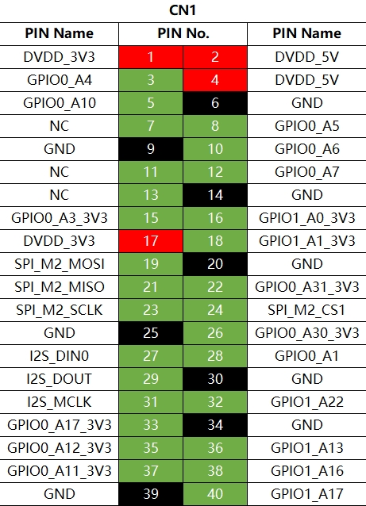

# **AXera—Pi 2（爱芯派—2）**

## **1. 快速开始**

### **1.1 简介**

#### **1.1.1 硬件简介**

爱芯派2（AXera—Pi 2）搭载搭载爱芯元智第四代智能视觉芯片 **[AX630C](https://www.axera-tech.com/Product/127.html)**，该芯片集成新一代智眸 4.0 AI-ISP，最高支持 4K@30fps 实时真黑光，同时集成新一代通元 4.0 高性能、场景优化的NPU引擎，使得产品在低功耗、高画质、智能处理和分析等方面行业领先。

爱芯派2（AXera—Pi 2）提供稳定易用的 SDK 软件开发包，方便用户低成本评估、 二次开发和快速量产。帮助用户在智能家居应用和其他 AIOT 项目中发挥更大的价值。

#### **1.1.2 硬件规格**

| **AXera—Pi 2**               | **规格**                                                     |
| :--------------------------- | ------------------------------------------------------------ |
| SoC                          | AX630C                                                       |
| 处理器                       | 2 x Arm Cortex-A53@1.2GHz                                    |
|    ISP能力    | 最大支持 4K@30fps AI-ISP&T-ISP 支持 3A AI-3DNR AIRLTM 两帧HDR图像增强 去雾功能 鱼眼矫正 |
| AI能力                       | 12.8TOPs@INT4 3.2TOPs@INT8                               |
| 操作系统                     | Ubuntu、Linux                                                |
| 深度学习框架                 | 支持 ONNX、PyTorch、Caffe、PaddlePaddle 等模型部署           |
| 视频编码能力                 | H.264/H.265 4K@30fps+1080P@30fps+720P@30fps              |
| 视频解码能力                 | H.264 1080P@60fps                                        |
|  图片编解码能力         | JPEG 编码 4K@40fps 解码 1080P@60fps                  |
| 其他功能                     | 支持 CBR/VBR/AVBR/CVBR 多种码率控制模式 支持 8 个 ROI 编码 |
| 内存                         | 4G LPDDR4X                                                   |
| 存储                         | 8G EMMC                                                      |
|     接口 | 1 x MIPI CSI 4-lane 1 x 10/100 RJ45 网口 1 x TF 卡槽 1 x HDMI 1 x Uart 2 x type-C ipex1 Wifi BT天线 RTC 电池接口 GPIO接口 2 x 按键（BOOT、RESET） 1 x LED 12V DC 供电 |
| 环境                         | 工作温度：-40°C ~ 85°C                                       |
| 功耗                         | 1.5W                                                         |
| 结构                         | 85 × 56 mm                                                   |

#### **1.1.3 硬件特点**

**高性价比**

- 内置双核 64 位高性能 ARM CPU；
- 内置 AI 算力 12.8 TOPs INT4 或 3.2 TOPs INT8；
- 内置AI-ISP，支持 500 万像素，支持 3A、3DNR、HDR、图像增强、去雾功能和鱼眼矫正算法；
- 内置 Audio Codec、ePHY；

**易部署**

- USB Type-C 调试；
- Ubuntu/Linux 系统；
- 丰富扩展接口；
- 软硬件资料丰富，开发者社区活跃；

#### **1.1.4 接口总览**

爱芯派2（AXera Pi 2）提供了网口、USB Type-C、HDMI、MIPI、TF卡槽、40PIN GPIO接口等功能接口，方便用户进行图像多媒体、深度学习算法等应用的开发和测试；开发板接口布局如下：

**电源接口**

爱芯派2（AXera—Pi 2）载板通过DC接口供电，推荐使用认证配件清单中推荐的12V/2A适配器。接入电源后，如绿色电源指示灯正常点亮，说明设备供电正常；

> [!Warning]
>
> 只支持DC接口供电

**调试串口**

爱芯派2（AXera—Pi 2）载板提供一路调试（接口待补充），硬件上通过`CH340`芯片实现USB转串口功能，用户可使用该接口进行各种调试工作。电脑串口工具的参数需按照如下方式配置：

- 波特率（Baud rate）：115200
- 数据位（Data bits）：8
- 奇偶校验（Parity）：None
- 停止位（Stop bits）：1
- 流控（Flow Control）：无

通常情况下，用户第一次使用该接口时需要在电脑上安装CH340驱动，用户可搜索`CH340串口驱动`关键字进行下载和安装；

**有线网口**

爱芯派2（AXera—Pi 2）载板提供一路百兆以太网接口，默认采用静态IP模式，IP地址`192.168.1.10`，3.0.0及以后系统的默认IP调整为`192.168.127.10` 。如需确认开发板IP地址，可通过串口登录设备，并用`ifconfig`命令进行查看 `eth0`网口的配置。

**HDMI接口**

爱芯派2（AXera—Pi 2）载板提供一路HDMI显示接口，最高支持1080P分辨率。

此外，HDIM还支持实时显示摄像头、网络流画面功能；

目前HDMI接口支持的显示分辨率如下：

- 1920x1080
- 1280x720
- 1024x600
- 800x480

**USB接口**

爱芯派2（AXera—Pi 2）只提供一路USB接口，接口描述如下：

|  接口类型  | 接口数量 |    接口描述     |
| :--------: | :------: | :-------------: |
| USB Type-C |    1     | 用于USB外设接入 |

USB主从模式切换完全由硬件电路实现；

**接入U盘**

爱芯派2（AXera—Pi 2）的TYPE-C Download&外设接口，支持U盘功能，可自动检测U盘接入并挂载，默认挂载目录为`/media/sda1`。

**USB摄像头**

爱芯派2（AXera—Pi 2）的TYPE-C Download&外设接口，支持USB摄像头功能，可自动检测USB摄像头接入并创建设备节点`/dev/video8`。

**MIPI CSI接口**

爱芯派2（AXera—Pi 2）提供1路MIPI CSI接口，可实现MIPI摄像头的接入。

目前开发板适配了多种规格的摄像头模组，模组型号、规格如下：

> [!Warning]
>
> 命令行输入：sample_vin --help有对应支持的摄像头

| **序号** | **Sensor** | **分辨率** | **FOV** | **I2C设备地址** |
| :------: | :--------: | :--------: | :-----: | :-------------: |
|    1     |  OS04A10   |            |         |                 |
|    2     |  SC450AI   |            |         |                 |
|    3     | S5KJN1SQ03 |            |         |                 |

摄像头模组通过FPC排线跟爱芯派2（AXera—Pi 2）连接，注意排线两端蓝面向上插入连接器；

需要图片

安装完成后，用户可以通过i2c detect命令确认模组I2C地址能否正常检测到；

> [!Warning]
>
> 重要提示：严禁在开发板未断电的情况下插拔摄像头，否则非常容易烧坏摄像头模组；

**MIPI DSI接口**

无该接口

**Micro SD接口**

爱芯派2（AXera—Pi 2）提供1路Micro SD存储卡接口。推荐使用至少8GB容量的存储卡，以便满足Ubuntu操作系统及相关功能包的安装要求；

> [!Warning]
>
> 重要提示：开发板使用中禁止热插拔TF存储卡，否则会造成系统运行异常，甚至造成存储卡文件系统损坏；

**Wi-Fi 天线接口**

爱芯派2（AXera—Pi 2）无板载天线，通常情况下需要连接外置天线，以增强信号强度；

**40pin header接口**

爱芯派2（AXera—Pi 2）提供一组40pin header接口，支持GPIO、UART、I2C、SPI、I2S等多种接口；

### **1.2 系统烧录**

在使用爱芯派2（AXera—Pi 2）开发板前，需要做下述准备工作。

**烧录准备**

**供电**

爱芯派2（AXera—Pi 2）通过载板上的电源接口供电，**官方板载**（此处需要补链接）通过DC接口供电，推荐使用认证配件清单中推荐的**12V/2A**适配器。

> [!Warning]
>
> 请不要使用电脑USB接口为开发板供电，否则会因供电不足造成开发板**异常断电、反复重启**等异常情况。
>
> 更多问题的处理，可以查阅 [常见问题](https://developer.d-robotics.cc/rdk_doc/FAQ/hardware_and_system) 章节。

**存储**

爱芯派2（AXera—Pi 2）采用Micro SD存储卡作为系统启动介质，推荐至少8GB容量的存储卡，以便满足Ubuntu系统、应用功能软件对存储空间的需求。

**显示**

爱芯派2（AXera—Pi 2）支持HDMI显示接口，通过HDMI线缆连接开发板和显示器，支持图形化桌面显示。

**网络连接**

爱芯派2（AXera—Pi 2）支持以太网、Wi-Fi两种网络接口，用户可通过任意接口实现网络连接功能

**系统烧录**

爱芯派2（AXera—Pi 2）目前提供Ubuntu 22.04系统镜像，可支持Desktop桌面图形化交互。

> [!CAUTION]
>
> 爱芯派2（AXera—Pi 2）出厂已经烧写测试版本系统镜像，为确保使用最新版本的系统，建议参考本文档完成最新版本系统镜像的烧写。

**镜像下载**

镜像文件下载，需通过爱芯派2（AXera—Pi 2）官方渠道提供；

下载完成后，解压出系统烧录的axp文件，如

下载完成后，SD卡烧写文件，如

**系统烧录流程**

爱芯派2（AXera—Pi 2）支持从有线 USB Type C 和SD卡烧录两种方式；

#### **1.2.1  有线烧录方式**

爱芯派2（AXera—Pi 2）有线（USB Type C）烧录方式需要使用AXDL工具进行烧录；

AXDL是运行在windows 10（32/64）操作系统上的应用程序，用于FLASH分区，镜像下载和读取等功能，支持USB或UART一托多下载；

> [!WARNING]
>
> USB下载时若PC未安装USB驱动，请首先安装USB驱动
>
> USB驱动仅支持window 10 32/64操作系统

**驱动安装**

步骤1：移除PC连接USB线

步骤2：使用管理员权限，双击DriversForWin10\DriverSetup.exe按照提示进行安装

步骤3：连接USB线，Windows会自动安装USB驱动

连接位置如图所示：

安装完成之后，Windows设备管理器显示如下：

**烧写步骤**

为简化用户操作，.axp文件已经包含了所需的下载镜像文件和参数配置（.xml），用户在下载时只需要加载这个.axp文件即可；

axp包支持对镜像文件计算MD5或者CRC，并在工具加载zxp包时进行校验，确保镜像文件完整性；

步骤1：双击AXDL.exe运行工具，界面显示如图所示：

步骤2：工具栏单击axp加载按钮，选择.axp镜像包文件

axp加载中

步骤3：工具栏单击“设置”按键，在“Setting”页面AXDL将axp镜像包镜像文件释放到本地Temp目录并自动进行配置，加载完成后用户可以鼠标双击或者**右键单击**镜像文件，激活文件选择框重新选择下载镜像文件

步骤4：爱芯派2（AXera—Pi 2）目前仅支持USB下载，切换到“Option”页面，配置如图所示：

> [!WARNING]
>
> Repartition默认勾选，推荐用户勾选
>
> 爱芯派2（AXera—Pi 2）目前仅支持USB下载，不要勾选“Uart Download”和"Upgrade Frequency"

步骤5：单击“OK”确认设置，在工具栏单击“开始”按钮启动下载，此时给开发板上电，下载工具将自动与开发板握手交互，开始下载。

具体连接如图所示：

然后同时按住下载（DOWNLOAD）和复位（RESET），随后松开复位（RESET），等几秒后，再松开下载（DOWNLOAD），之后请等待30秒左右工具上面会出行进度条，如下图所示：

步骤6：等待几分钟后，下载完成结果如下图所示：

#### **1.2.2  SD卡烧录方式**

> [!WARNING]
>
> 通过SD卡烧录系统镜像前，需要做如下准备：
>
> - 准备至少8GB容量的Mico SD卡
> - SD读卡器
> - 下载镜像烧录工具balenaEtcher（[可点击此处下载](https://etcher.balena.io/)）

balenaEtcher是一款支持Windows/Mac/Linux等多平台的PC端启动盘制作工具，制作SD启动卡流程如下：

1，打开balenaEtcher工具，点击`从文件烧录`按钮，选择解压出来的`ax_pi2.img.zip`文件作为烧录镜像

2，点击`选择目标磁盘`按钮，选择对应的Micro SD存储卡作为目标存储设备

3，点击`现在烧录！`按钮开始烧录，待工具提示`烧录完成！`时，表示镜像烧录完成，可以关闭balenaEtcher并取出存储卡

> [!WARNING]
>
> 在验证过程后，会出现上述提示，此时点击“Cancle”即可

4，SD卡插入爱芯派2（AXera—Pi 2），板卡上电，即自动进入SD卡烧录过程

5，此时可通过串口，查看烧录状态，烧录完成如下图所示：

6，如果没有进入SD卡烧录过程，请使用如下方法重置SD卡烧录

> [!NOTE]
>
> - 通过串口，输入fw_printenv命令，可查看SD卡烧写状态，如下图所示
> - 如果sdupdate=finish，可输入fw_sdupdate，重置SD烧写，如下图所示,fdtcontroladdr=bbdc75a0，表示可重新进行SD卡烧写，此时重新板卡上电即可

> [!WARNING]
>
> 如烧录过程中发生中断，请按照上述步骤重新进行

**启动系统**

爱芯派2（AXera—Pi 2）支持从eMMC和SD卡两种模式启动系统

- 当板卡的eMMC没有烧录过系统镜像的情况下，插入制作好系统的SD卡到载板即可通过从SD卡启动系统
- 如果模组上的eMMC已经烧录过系统镜像，则直接从eMMC启动系统

最后，首先保持板卡断电，然后通过HDMI线缆连接板卡与显示器，最后给开发板上电

Ubuntu Desktop版本系统启动完成后，会通过HDMI接口在显示器上输出系统桌面，如下图所示：

**常见问题**

首次使用开发板时的常见问题如下：

- **上电不开机** ：请确保使用[供电](https://developer.d-robotics.cc/rdk_doc/Quick_start/install_os/rdk_x3#供电)中推荐的适配器供电；请确保板卡的Micro SD卡或eMMC已经烧录过Ubuntu系统镜像
- **USB Host接口无反应** ：请确保板卡Micro USB接口有接入数据线
- **使用中热插拔存储卡** ：开发板不支持热插拔Micro SD存储卡，如发生误操作请重启开发板

**注意事项**

- 禁止带电时拔插除USB、HDMI、网线之外的任何设备
- 爱芯派2（AXera—Pi 2）的Type C USB接口不能用作供电
- 选用符合供电规格的电源适配器，否则会出现供电异常，导致系统异常断电的问题

### **1.3 远程登录**

本章节旨在向需要通过个人电脑(PC)远程访问爱芯派2（AXera—Pi 2）的用户介绍如何通过串口方式进行远程登录

在使用串口登录前，需要确认开发板串口线跟电脑正确连接，连接方式如下图所示：

串口登录需要借助PC终端工具，目前常用的工具有`Putty`、`MobaXterm`等，用户可根据自身使用习惯来选择；

不同工具的端口配置流程基本类似，下面以`MobaXterm`为例，介绍新建串口连接过程：

- 当串口USB转接板首次插入电脑时，需要安装串口驱动；驱动安装完成后，设备管理器可正常识别串口端口，如下图所示：

  

- 打开`MobaXterm`工具，点击`Session`，然后选择`Serial`

- 配置端口号，例如`COM4`，实际使用的串口号以PC识别到的串口号为准。如下图所示：

  

  

- 设置串口配置参数，如下：

  |        配置项        | 参数值 |
  | :------------------: | :----: |
  | 波特率（Baud rate）  | 115200 |
  | 数据位（Data bits）  |   8    |
  |  奇偶校验（Parity）  |  None  |
  | 停止位（Stop bits）  |   1    |
  | 流控（Flow Control） |   无   |

  

- 点击如`OK`，登录设备

### **1.4 算法体验**

待补充

### **1.5资源下载汇总**

**硬件设计（Hardware）**

- **描述：**硬件相关的文档和设计资源，以帮助你了解产品的组件和接口
- **下载链接：**待补充

**刷机工具（AXDL）**

- **描述：**AXDL是用于烧录爱芯派2（AXera—Pi 2）开发板操作系统镜像的工具
- **下载链接：**待补充

**操作系统镜像（OS Images）**

- **描述：**这里包含了适用于 爱芯派2（AXera—Pi 2）的 Ubuntu 操作系统镜像文件。你可以选择适合你需求的版本进行下载
- **下载链接：**待补充

