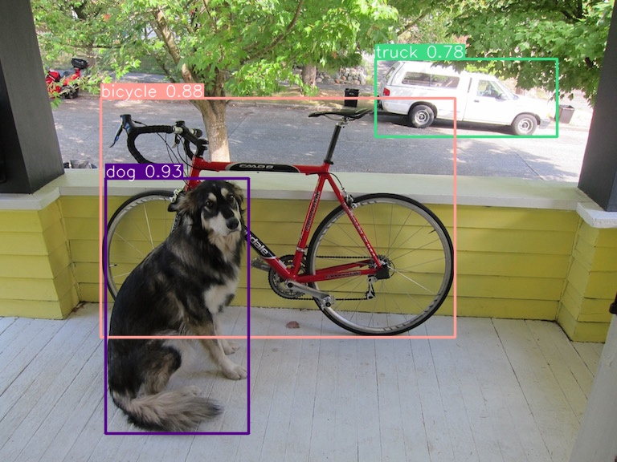
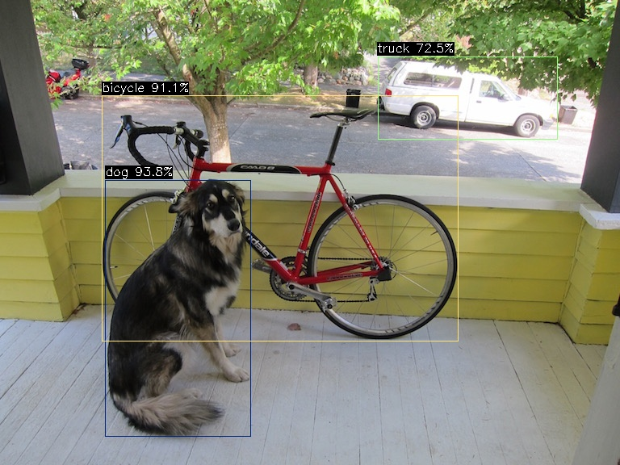

# 算法部署教程

本章节将向您展示：

- 如何通过 [ultralytics](https://github.com/ultralytics/ultralytics) 官方项目导出 [YOLOv8](https://github.com/ultralytics/ultralytics/blob/main/docs/en/models/yolov8.md) 的 ONNX 模型；
- 通过 ONNX 自带的工具，获得优化后的计算图；
- 通过 Pulsar2 工具链量化&编译生成 AX630C 适配的 NPU 模型；
- 将 GitHub 开源项目 [ax_samples](https://github.com/AXERA-TECH/ax-samples) 中 [YOLOv8](https://github.com/AXERA-TECH/ax-samples/tree/main/examples/ax620e#YOLOv8) 运行在社区开发板 爱芯派Zero 上。

## YOLOv8

**YOLOv8**（**Y**ou **O**nly **L**ook **O**nce **v**ersion **8**）是由 Ultralytics 公司在2023年1月10日开源的 YOLOv5 的下一个重大更新版本。YOLOv8 继续沿用了 YOLO 系列模型的设计理念，即通过一次前向传播（You Only Look Once）来快速准确地识别图像中的物体。这个版本在 YOLOv5 的基础上进行了多项改进，以提升性能和灵活性，使其适用于图像分类、物体检测和实例分割等多种视觉任务。

## ONNX 模型获得

### 环境准备

默认已经基于 miniconda 搭建 ultralytics repo 必要的 python 环境。同时准备好导出 ONNX 模型必要的第三方依赖

```
pip install onnx
pip install onnxruntime
pip install onnxsim
```

完成 ultralytics 项目安装

```
pip install ultralytics
```

### 导出 ONNX

下面的 python 脚本用于 **下载、运行、导出** YOLOv8s 的 ONNX 模型

```from ultralytics import YOLO

# Load a model
model = YOLO("yolov8s.pt")
model.info()

# Use the model
results = model("/home/qtang/images/ssd_dog.jpg")

# Save the results
results[0].save("yolov8s-result.jpg")

# Export to onnx with simplify
model.export(format='onnx', simplify=True)
```

执行过程如下

```
(ultralytics) qtang@gpux2:~/ultralytics$ python yolov8-test.py
YOLOv8s summary: 225 layers, 11166560 parameters, 0 gradients, 28.8 GFLOPs

image 1/1 /home/qtang/images/ssd_dog.jpg: 480x640 1 bicycle, 1 truck, 1 dog, 81.8ms
Speed: 4.6ms preprocess, 81.8ms inference, 336.5ms postprocess per image at shape (1, 3, 480, 640)
Ultralytics YOLOv8.1.15 🚀 Python-3.9.18 torch-2.2.0+cu121 CPU (AMD Ryzen Threadripper 3970X 32-Core Processor)

PyTorch: starting from 'yolov8s.pt' with input shape (1, 3, 640, 640) BCHW and output shape(s) (1, 84, 8400) (21.5 MB)

ONNX: starting export with onnx 1.15.0 opset 17...
ONNX: simplifying with onnxsim 0.4.35...
ONNX: export success ✅ 1.6s, saved as 'yolov8s.onnx' (42.7 MB)

Export complete (3.7s)
Results saved to /home/qtang/ultralytics
Predict:         yolo predict task=detect model=yolov8s.onnx imgsz=640
Validate:        yolo val task=detect model=yolov8s.onnx imgsz=640 data=coco.yaml
Visualize:       https://netron.app
(ultralytics) (npu-dev-env) qtang@gpux2:~/ultralytics$
```

输入图片


执行完成后将获得 yolov8s.onnx 模型以及使用测试图片 ssd_dog.jpg 的推理计算结果



## 模型转换

### ONNX 模型优化

在使用 pulsar2 工具链转换之前，先对前一步获得的 yolov8s.onnx 模型进行必要的计算图优化，便于提高模型部署效率。

```
import onnx

input_path = "yolov8s.onnx"
output_path = "yolov8s-cut.onnx"
input_names = ["images"]
output_names = ["/model.22/Concat_output_0", "/model.22/Concat_1_output_0", "/model.22/Concat_2_output_0"]

onnx.utils.extract_model(input_path, output_path, input_names, output_names)
```

切图后的模型差异


### Pulsar2 编译

[Pulsar2](https://pulsar2-docs.readthedocs.io/zh-cn/latest/index.html) 是新一代AI工具链，包含 模型转换、离线量化、模型编译、异构调度 四合一超强功能，进一步强化了网络模型高效部署的需求。在针对第三代、第四代 NPU 架构进行了深度定制优化的同时，也扩展了算子&模型支持的能力及范围，对 Transformer 结构的网络也有较好的支持。


一键完成 图优化、离线量化、编译、对分功能。整个过程耗时不到5分钟，相比上一代工具链模型编译效率有了数量级的提升。默认已经搭建好了基于 Docker 的 Pulsar2 工具链使用环境。

| 文件名              | 描述                            |
| ------------------- | --------------------------------- |
| yolov8s_config.json | 模型转换必要的配置文件            |
| yolov8s-cut.onnx    | 待转换的 ONNX 模型                |
| coco_1000.tar       | 模型转换 PTQ 依赖的量化校准数据集 |

配置文件 yolov8s_config.json，需要根据模型的输出节点进行修改，比如，以下配置文件中，需要将output_processors 中三个 tensor_name，修改为您根据文章内容得到的 yolov8s-cut.onnx 的模型的输出节点的名称，如下，我将其填充为 /model.22/Concat_output_0、/model.22/Concat_1_output_0、/model.22/Concat_2_output_0，此步骤的作用是在模型输出节点上加上一个 transpose 以适应 ax-samples 中的后处理代码，将输出节点的 shape 从

```
1*144*80*80
1*144*40*40
1*144*20*20
```

改为

```
1*80*80*144
1*40*40*144
1*20*20*144
```

yolov8s_config.json 如下所示

```
{
  "model_type": "ONNX",
  "npu_mode": "NPU1",
  "quant": {
    "input_configs": [
      {
        "tensor_name": "images",
        "calibration_dataset": "./dataset/coco_1000.tar",
        "calibration_size": 32,
        "calibration_mean": [0, 0, 0],
        "calibration_std": [255.0, 255.0, 255.0]
      }
    ],
    "calibration_method": "MSE",
    "precision_analysis": true,
    "precision_analysis_method":"EndToEnd"
  },
  "input_processors": [
    {
      "tensor_name": "images",
      "tensor_format": "BGR",
      "src_format": "BGR",
      "src_dtype": "U8",
      "src_layout": "NHWC"
    }
  ],
  "output_processors": [
    {
      "tensor_name": "/model.22/Concat_output_0",
      "dst_perm": [0, 2, 3, 1]
    },    {
      "tensor_name": "/model.22/Concat_1_output_0",
      "dst_perm": [0, 2, 3, 1]
    },    {
      "tensor_name": "/model.22/Concat_2_output_0",
      "dst_perm": [0, 2, 3, 1]
    }
  ],
  "compiler": {
    "check": 0
  }
}
```

转换命令如下

```
pulsar2 build --input yolov8s-cut.onnx --config yolov8s_config.json --output_dir output --output_name yolov8s.axmodel --target_hardware AX620E
```
转换完成之后，将在 ./output 路径下生成 yolov8s.axmodel 文件，该文件用于最终上板运行。

## 上板示例

默认已完成 爱芯派Zero 开发板测试环境搭建，能通过 SSH 登录进控制台。上板示例运行依赖一下文件

| 文件名          | 描述                                 |
| --------------- | ------------------------------------ |
| ax_yolov8       | 基于 AX620Q 的 YOLOv8 DEMO，NPU 计算 |
| yolov8s.axmodel | 通过 pulsar2 转换生成的 axmodel      |
| ssd_dog.jpg     | 测试图片                             |

ax_yolov8 请参考 [ax-samples](https://github.com/AXERA-TECH/ax-samples) 项目编译获得。执行结果如下

```
root@ax620e:/root # ./ax_yolov8 -m yolov8s.axmodel -i ssd_dog.jpg
--------------------------------------
model file : yolov8s.axmodel
image file : ssd_dog.jpg
img_h, img_w : 640 640
--------------------------------------
Engine creating handle is done.
Engine creating context is done.
Engine get io info is done.
Engine alloc io is done.
Engine push input is done.
--------------------------------------
post process cost time:8.57 ms
--------------------------------------
Repeat 10 times, avg time 27.13 ms, max_time 27.14 ms, min_time 27.12 ms
--------------------------------------
detection num: 3
16:  94%, [ 130,  223,  311,  541], dog
 1:  91%, [ 126,  118,  569,  423], bicycle
 7:  73%, [ 468,   70,  691,  173], truck
--------------------------------------
```
执行完成后在当前路径下会生成 yolov8s_out.jpg



## 结束语

本章节会根据用户反馈不断更新和完善，毕竟基于 AX620Q 这类普惠AI芯片最常见的智能算法应用便是目标检测任务。

- 本文相关文件均可通过 [百度网盘](https://pan.baidu.com/s/1OKKDtXHOvRT3EyiYh4Sjow?pwd=s2rd) 获取
- 本文部署 YOLOv8 的方案也适用于 AX650A、AX650N、AX620Q
- 更多的 AI 示例请参考我们在 Github 上的开源项目 [ax_samples](https://github.com/AXERA-TECH/ax-samples)
