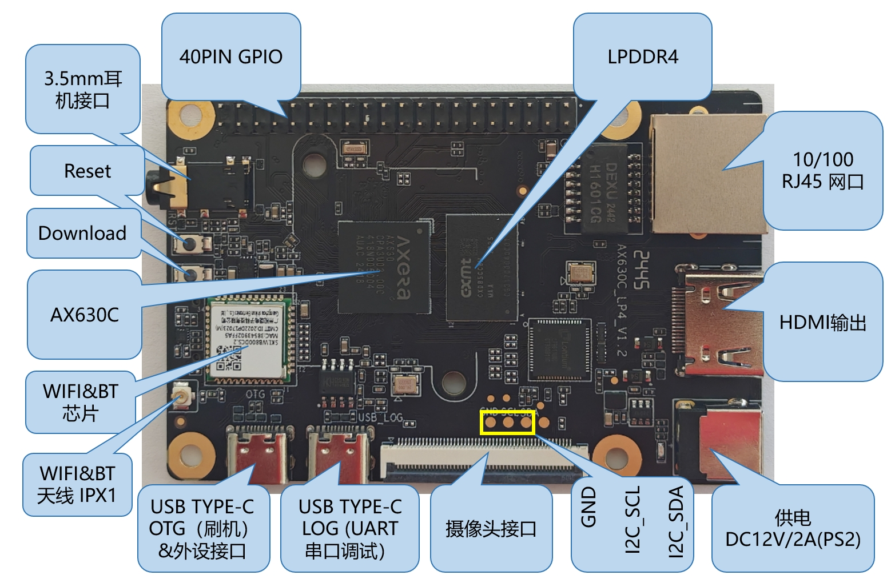
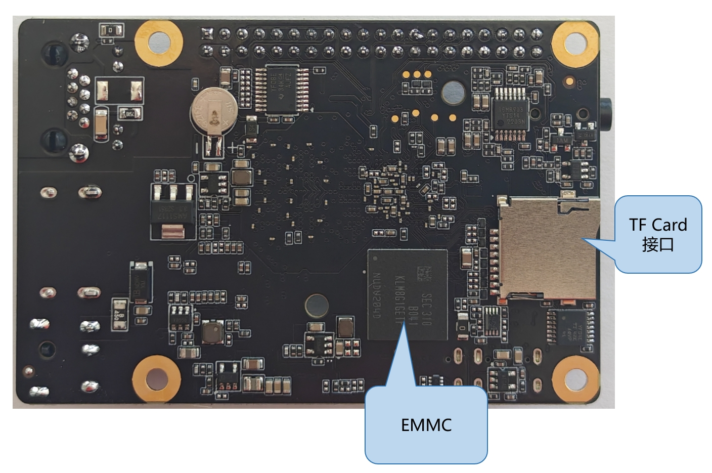
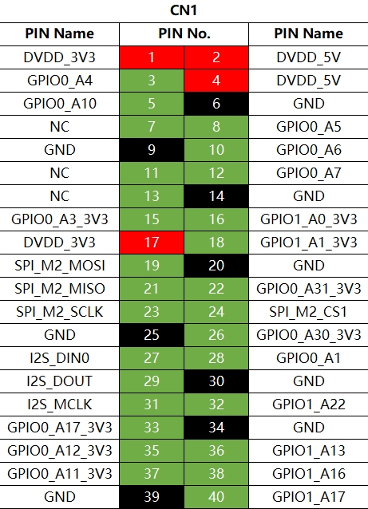
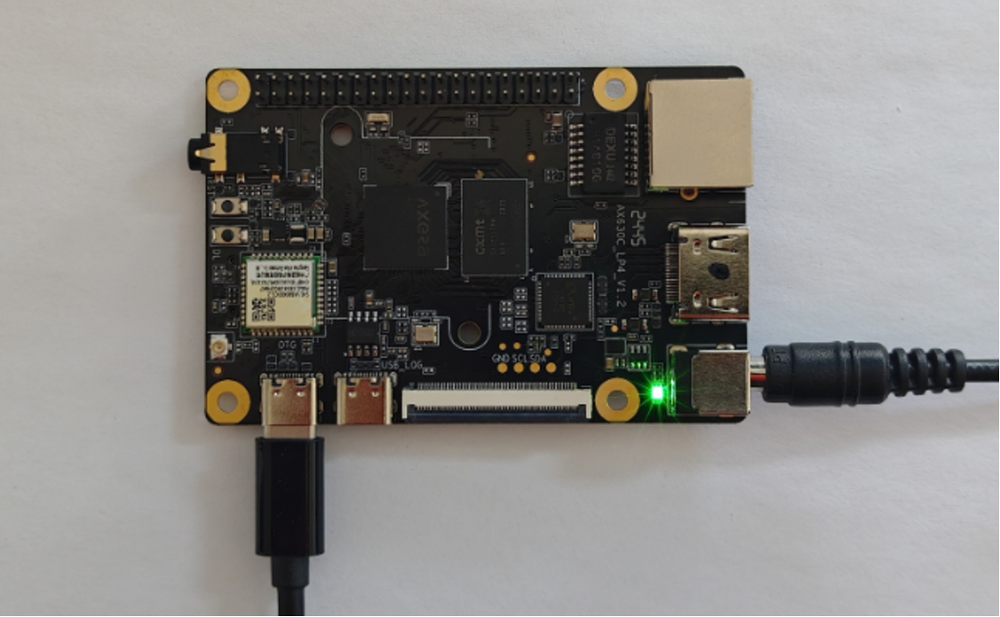

# 硬件接口资料

## 接口总览

爱芯派2（AXera Pi 2）提供了网口、USB Type-C、HDMI、MIPI、TF卡槽、40PIN GPIO接口等功能接口，方便用户进行图像多媒体、深度学习算法等应用的开发和测试；开发板接口布局如下：

**电源接口**

爱芯派2（AXera—Pi 2）载板通过DC接口供电，推荐使用认证配件清单中推荐的12V/2A适配器。接入电源后，如绿色电源指示灯正常点亮，说明设备供电正常；

> [!WARNING]
>
> 只支持DC接口供电

**调试串口**

爱芯派2（AXera—Pi 2）载板提供一路调试（接口待补充），硬件上通过`CH340`芯片实现USB转串口功能，用户可使用该接口进行各种调试工作。电脑串口工具的参数需按照如下方式配置：

- 波特率（Baud rate）：115200
- 数据位（Data bits）：8
- 奇偶校验（Parity）：None
- 停止位（Stop bits）：1
- 流控（Flow Control）：无

通常情况下，用户第一次使用该接口时需要在电脑上安装CH340驱动，用户可搜索`CH340串口驱动`关键字进行下载和安装；

**有线网口**

爱芯派2（AXera—Pi 2）载板提供一路百兆以太网接口，默认采用静态IP模式，IP地址`192.168.1.10`，3.0.0及以后系统的默认IP调整为`192.168.127.10` 。如需确认开发板IP地址，可通过串口登录设备，并用`ifconfig`命令进行查看 `eth0`网口的配置。

**HDMI接口**

爱芯派2（AXera—Pi 2）载板提供一路HDMI显示接口，最高支持1080P分辨率。

此外，HDIM还支持实时显示摄像头、网络流画面功能；

目前HDMI接口支持的显示分辨率如下：

- 1920x1080
- 1280x720
- 1024x600
- 800x480

**USB接口**

爱芯派2（AXera—Pi 2）只提供一路USB接口，接口描述如下：

|  接口类型  | 接口数量 |    接口描述     |
| :--------: | :------: | :-------------: |
| USB Type-C |    1     | 用于USB外设接入 |

USB主从模式切换完全由硬件电路实现；

**接入U盘**

爱芯派2（AXera—Pi 2）的TYPE-C Download&外设接口，支持U盘功能，可自动检测U盘接入并挂载，默认挂载目录为`/media/sda1`。

**USB摄像头**

爱芯派2（AXera—Pi 2）的TYPE-C Download&外设接口，支持USB摄像头功能，可自动检测USB摄像头接入并创建设备节点`/dev/video8`。

**MIPI CSI接口**

爱芯派2（AXera—Pi 2）提供1路MIPI CSI接口，可实现MIPI摄像头的接入。

目前开发板适配了多种规格的摄像头模组，模组型号、规格如下：

> [!WARNING]
>
> 命令行输入：sample_vin --help有对应支持的摄像头

| **序号** | **Sensor** | **分辨率** | **FOV** | **I2C设备地址** |
| :------: | :--------: | :--------: | :-----: | :-------------: |
|    1     |  OS04A10   |            |         |                 |
|    2     |  SC450AI   |            |         |                 |
|    3     | S5KJN1SQ03 |            |         |                 |

摄像头模组通过FPC排线跟爱芯派2（AXera—Pi 2）连接，注意排线两端蓝面向上插入连接器；

安装完成后，用户可以通过i2c detect命令确认模组I2C地址能否正常检测到；

**MIPI DSI接口**

无该接口

**Micro SD接口**

爱芯派2（AXera—Pi 2）提供1路Micro SD存储卡接口。推荐使用至少8GB容量的存储卡，以便满足Ubuntu操作系统及相关功能包的安装要求；

> [!WARNING]
>
> 重要提示：开发板使用中禁止热插拔TF存储卡，否则会造成系统运行异常，甚至造成存储卡文件系统损坏；

**Wi-Fi 天线接口**

爱芯派2（AXera—Pi 2）无板载天线，通常情况下需要连接外置天线，以增强信号强度；

**40pin header接口**

爱芯派2（AXera—Pi 2）提供一组40pin header接口，支持GPIO、UART、I2C、SPI、I2S等多种接口；

## 管脚定义

## 实物图

## 硬件资料

硬件资料可通过[百度网盘(待补充)]()自行下载。
